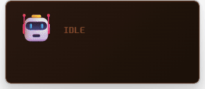

# Claude Pet

[Claude Code](https://docs.anthropic.com/en/docs/claude-code)의 작업 상태를 실시간으로 보여주는 가벼운 데스크톱 펫.

[Tauri 2](https://tauri.app/) 기반 — 최종 바이너리 ~8 MB.

**번역**: [English](./README.md) · [번역 추가하기!](./CONTRIBUTING.md#adding-a-readme-translation)

[](https://github.com/IMMINJU/claude-pet)
[](https://github.com/IMMINJU/claude-pet/releases)


<p align="center">
  
</p>

## 왜 만들었나요?

회사에서 Claude Code를 여러 세션 돌리다 보니, 어떤 세션이 입력을 기다리는지 놓치는 일이 잦았습니다. 사무실이라 소리도 못 쓰고요. 그래서 각 세션이 뭘 하고 있는지 캐릭터 애니메이션으로 보여주는 작은 위젯을 만들었습니다. 상태를 이모지로 표시하다 보니, 성공하면 웃고 에러 나면 당황하고 대기 중엔 졸고 — 어느새 상태 표시기가 아니라 살아있는 캐릭터처럼 느껴졌습니다. 그래서 그냥 "펫"이라고 부르기로 했습니다.

## 뭘 하는 앱인가요?

Claude Code가 지금 뭘 하고 있는지 바탕화면 위에 보여줍니다. 파일 읽기, 코드 작성, 명령 실행, 검색 등 각 작업마다 다른 이모지와 애니메이션이 나타납니다.

예를 들면: 📖 파일 읽기, ✍️ 코드 작성, ⚡ 명령 실행, 🔍 검색, 😰 에러, 🙋 입력 대기 — 총 17가지 상태마다 다른 애니메이션이 나옵니다.

세션을 여러 개 실행하면 나란히 표시됩니다 (📖A ⚡B 🔍C).

## 동작 원리

```
Claude Code hooks → claude-pet --hook → TCP 소켓 → Tauri (Rust) → WebView UI
```

1. Claude Code가 훅 이벤트를 발생시킴 (PreToolUse, PostToolUse, Notification, Stop, SessionStart/End 등)
2. 내장 훅 전송기(`claude-pet --hook`)가 stdin에서 JSON을 읽어 `127.0.0.1:19876`으로 전송
3. Rust 백엔드가 JSON을 받아 프론트엔드로 emit
4. 프론트엔드가 이모지, 애니메이션, 말풍선 업데이트

## 설치

### 빠른 설치 (빌드된 바이너리)

**macOS / Linux:**

```bash
curl -fsSL https://raw.githubusercontent.com/IMMINJU/claude-pet/main/install.sh | sh
```

**Windows (PowerShell):**

```powershell
irm https://raw.githubusercontent.com/IMMINJU/claude-pet/main/install.ps1 | iex
```

최신 릴리스를 다운로드하고, `~/.claude-pet` (Windows: `%LOCALAPPDATA%\claude-pet`)에 설치한 뒤, Claude Code 훅을 자동 등록합니다.

### 소스에서 빌드

<details>
<summary>사전 요구사항</summary>

- [Rust](https://rustup.rs/) (stable)
- [Node.js](https://nodejs.org/) 18+
- [Tauri 2 플랫폼별 의존성](https://v2.tauri.app/start/prerequisites/)

</details>

```bash
git clone https://github.com/IMMINJU/claude-pet.git
cd claude-pet
npm install
npm run build
```

바이너리 위치: `src-tauri/target/release/claude-pet` (Windows는 `.exe`)

앱 시작 시 훅이 자동 등록됩니다 — 수동 설정 불필요.

## 사용법

1. 펫 실행: 빌드된 바이너리 실행 또는 개발 모드 `npm run dev`
2. Claude Code 시작 — 매 도구 호출마다 펫이 반응합니다
3. 위젯을 **드래그**해서 원하는 위치로 이동
4. **우클릭**으로 컨텍스트 메뉴:
   - 언어 — 사용 가능한 언어 간 전환
   - 테마 — 내장 테마 간 전환
   - 집중 모드 — 완료/에러/알림에만 반응
   - 세션 초기화
   - 종료

## 특징

~8 MB 단일 바이너리, 런타임 의존성 없음. 투명하고 프레임 없는 항상-위 위젯. 여러 Claude Code 세션을 동시에 추적. 내장 테마 3개 (Default, Cat, Fruits) + 직접 만들기 가능. 집중 모드로 완료/에러/알림만 받기. 영어/한국어 UI, 언어 추가도 쉬움.

> 현재 Windows 11에서만 테스트했습니다. macOS/Linux 피드백 환영합니다.

## 테마

우클릭 → 테마에서 내장 테마를 전환할 수 있습니다. 각 테마마다 고유한 이모지와 색상이 있습니다.

| 테마 | 대기 | 성공 | 에러 | 색상 톤 |
|------|------|------|------|---------|
| Default | 🤖 | ✅ | 😰 | 오렌지/브라운 |
| Cat | 🐱 | 😻 | 🙀 | 핑크/퍼플 |
| Fruits | 🍎 | 🍉 | 🍅 | 레드/그린 (이미지) |

### 커스텀 테마

`~/.claude-pet/themes/your-theme/` 폴더에 `config.json`을 만드세요:

```json
{
  "name": "My Theme",
  "type": "emoji",
  "colors": {
    "bgStart": "#1a1a2e",
    "bgEnd": "#101020",
    "accent": "100, 100, 255",
    "text": "#e0e0ff"
  },
  "states": {
    "idle": { "emoji": "🦊" },
    "read": { "emoji": "📚" },
    "write": { "emoji": "✏️" },
    "bash": { "emoji": "💥" },
    "search": { "emoji": "🔎" },
    "task": { "emoji": "🤖" },
    "web": { "emoji": "🌍" },
    "success": { "emoji": "🎉" },
    "error": { "emoji": "💔" },
    "notification": { "emoji": "🔔" },
    "stop": { "emoji": "💤" }
  }
}
```

이미지 테마는 `"type": "image"`에 `"emoji"` 대신 `"src": "filename.gif"`를 사용합니다. 커스텀 폰트도 지원됩니다. 자세한 내용은 [CONTRIBUTING.md](./CONTRIBUTING.md)를 참고하세요.

## 개발

```bash
npm run dev
```

프론트엔드 핫 리로드와 함께 개발 모드로 실행됩니다.

이벤트 수동 테스트:

```bash
echo '{"hook_event_name":"PreToolUse","tool_name":"Read","session_id":"test"}' | ./src-tauri/target/debug/claude-pet --hook
```

## 아키텍처

```
┌──────────────────────────────────────────────────┐
│              Claude Code (터미널)                   │
│  hooks: PreToolUse, PostToolUse, Notification...  │
└──────────────────┬───────────────────────────────┘
                   │ stdin (JSON)
                   ▼
          ┌──────────────────┐
          │ claude-pet --hook │
          └────────┬─────────┘
                   │ TCP :19876
                   ▼
┌──────────────────────────────────────────────────┐
│              Claude Pet (Tauri 2)                  │
│  ┌──────────┐    emit     ┌────────────────────┐ │
│  │ Rust TCP │ ──────────▶ │ WebView (HTML/CSS) │ │
│  │ listener │             │ emoji + animation  │ │
│  └──────────┘             └────────────────────┘ │
└──────────────────────────────────────────────────┘
```

## 삭제

**macOS / Linux:**

```bash
rm -rf ~/.claude-pet
```

**Windows (PowerShell):**

```powershell
Remove-Item -Recurse -Force "$env:LOCALAPPDATA\claude-pet"
```

그다음 `~/.claude/settings.json`에서 `claude-pet`이 포함된 훅 항목을 삭제하세요 (`PreToolUse`, `PostToolUse`, `PostToolUseFailure`, `Notification`, `Stop`, `SessionStart`, `SessionEnd`, `SubagentStart`, `SubagentStop`, `TaskCompleted`).

## 기여

기여를 환영합니다! 자세한 가이드는 [CONTRIBUTING.md](./CONTRIBUTING.md)를 참고하세요.

시작하기 쉬운 것들: [테마 만들기](./CONTRIBUTING.md#creating-a-theme) (JSON + 이미지), [언어 추가](./CONTRIBUTING.md#adding-a-language) (JSON 파일 하나), [README 번역](./CONTRIBUTING.md#adding-a-readme-translation).

## 라이선스

MIT

[Neo둥근모](https://github.com/neodgm/neodgm) 폰트 by Eunbin Jeong (Dalgona.) — [SIL Open Font License 1.1](https://scripts.sil.org/OFL)
