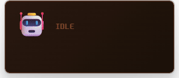

# Claude Pet

A lightweight desktop pet that reacts to [Claude Code](https://docs.anthropic.com/en/docs/claude-code) in real time.

Built with [Tauri 2](https://tauri.app/) — the final binary is ~8 MB.

**Translations**: [한국어](./README.ko.md) · [Add yours!](./CONTRIBUTING.md#adding-a-readme-translation)

[](https://github.com/IMMINJU/claude-pet)
[](https://github.com/IMMINJU/claude-pet/releases)


<p align="center">
  
</p>

## Why?

When Claude Code is working, all you see is a wall of text scrolling by. Claude Pet gives you a **glanceable, always-on-top widget** that shows what Claude is doing right now — so you can keep working (or keep watching) without switching windows.

## What It Does

Claude Pet sits on your desktop and shows what Claude Code is doing — reading files, writing code, running commands, searching, and more. Each action triggers a different emoji and animation.

| Event | Emoji | Animation |
|-------|-------|-----------|
| Read | 📖 | Gentle sway |
| Edit / Write | ✍️ | Nodding |
| Bash | ⚡ | Flash pulse |
| Grep / Glob | 🔍 | Side-to-side |
| Task (Agent) | 🤖 | Spin |
| Web | 🌐 | Glow pulse |
| Notification | 🙋 | Bounce |
| Stop | 😴 | Slow pulse |
| Idle | 🤖 | Float |

**Multi-session**: When you run multiple Claude Code sessions, the pet shows each one side by side (📖A ⚡B 🔍C).

## How It Works

```
Claude Code hooks → claude-pet --hook → TCP socket → Tauri (Rust) → WebView UI
```

1. Claude Code fires hook events (PreToolUse, PostToolUse, Notification, Stop)
2. The built-in hook sender (`claude-pet --hook`) reads JSON from stdin and sends it to `127.0.0.1:19876`
3. The Rust backend receives the JSON and emits it to the frontend
4. The frontend updates the emoji, animation, and speech bubble

## Installation

### Quick Start (pre-built binary)

**macOS / Linux:**

```bash
curl -fsSL https://raw.githubusercontent.com/IMMINJU/claude-pet/main/install.sh | sh
```

**Windows (PowerShell):**

```powershell
irm https://raw.githubusercontent.com/IMMINJU/claude-pet/main/install.ps1 | iex
```

This downloads the latest release, installs to `~/.claude-pet` (or `%LOCALAPPDATA%\claude-pet` on Windows), and registers the Claude Code hooks automatically.

### Build from Source

<details>
<summary>Prerequisites</summary>

- [Rust](https://rustup.rs/) (stable)
- [Node.js](https://nodejs.org/) 18+
- Platform-specific dependencies for [Tauri 2](https://v2.tauri.app/start/prerequisites/)

</details>

```bash
git clone https://github.com/IMMINJU/claude-pet.git
cd claude-pet
npm install
npm run build
```

The binary will be at `src-tauri/target/release/claude-pet` (or `.exe` on Windows).

Hooks are registered automatically when the app starts — no manual configuration needed.

## Usage

1. Launch the pet: run the built binary or `npm run dev` for development
2. Start Claude Code — the pet will react to every tool call
3. **Drag** the widget anywhere on your desktop
4. **Right-click** to open the context menu:
   - Language — switch between available languages
   - Theme — switch between built-in themes
   - Focus Mode — only react to completion, errors, and notifications
   - Reset Sessions
   - Quit

## Features

- **Tiny** — ~8 MB standalone binary, no runtime dependencies
- **Transparent & frameless** — always-on-top floating widget
- **Pixel font** — [NeoDungGeunMo](https://github.com/neodgm/neodgm) for a retro look
- **Themes** — 6 built-in themes (Default, Cat, Space, Ocean, Garden, Fruits) with customizable colors and fonts
- **Multilingual** — English and Korean out of the box, easily extensible
- **Focus Mode** — hides routine tool calls, only reacts to completion/errors/notifications
- **Multi-session** — tracks multiple Claude Code instances simultaneously
- **10 animations** — each tool type gets its own CSS animation
- **Cross-platform** — builds on Windows, macOS, and Linux

> **Note**: Currently tested on Windows 11. macOS/Linux testing and feedback welcome.

## Themes

Right-click → Theme to switch between built-in themes. Each theme has its own emojis and color scheme.

| Theme | Idle | Success | Error | Color Tone |
|-------|------|---------|-------|------------|
| Default | 🤖 | ✅ | 😰 | Orange/Brown |
| Cat | 🐱 | 😻 | 🙀 | Pink/Purple |
| Space | 🚀 | ⭐ | ☄️ | Navy/Cyan |
| Ocean | 🐙 | 🐚 | 🦀 | Deep Blue/Mint |
| Garden | 🌱 | 🌸 | 🥀 | Dark Green/Lime |
| Fruits | 🍎 | 🍉 | 🍅 | Red/Green (image) |

### Custom Themes

Create a folder in `~/.claude-pet/themes/your-theme/` with a `config.json`:

```json
{
  "name": "My Theme",
  "type": "emoji",
  "colors": {
    "bgStart": "#1a1a2e",
    "bgEnd": "#101020",
    "accent": "100, 100, 255",
    "text": "#e0e0ff"
  },
  "states": {
    "idle": { "emoji": "🦊" },
    "read": { "emoji": "📚" },
    "write": { "emoji": "✏️" },
    "bash": { "emoji": "💥" },
    "search": { "emoji": "🔎" },
    "task": { "emoji": "🤖" },
    "web": { "emoji": "🌍" },
    "success": { "emoji": "🎉" },
    "error": { "emoji": "💔" },
    "notification": { "emoji": "🔔" },
    "stop": { "emoji": "💤" }
  }
}
```

Image themes use `"type": "image"` with `"src": "filename.gif"` instead of `"emoji"`. Custom fonts are also supported. See [CONTRIBUTING.md](./CONTRIBUTING.md) for details.

## Project Structure

```
claude-pet/
├── src/                        # Frontend (HTML/CSS/JS)
│   ├── index.html              # Widget layout
│   ├── main.js                 # Initialization & context menu
│   ├── sessions.js             # Session management & display
│   ├── states.js               # Tool → state mapping
│   ├── themes.js               # Theme system (colors, fonts, images)
│   ├── i18n.js                 # Internationalization
│   ├── styles.css              # Animations & theming (CSS variables)
│   ├── locales/                # Translation files
│   │   ├── index.json          # Available languages
│   │   ├── en.json
│   │   └── ko.json
│   ├── themes/                 # Built-in themes
│   │   ├── default/config.json
│   │   ├── cat/config.json
│   │   ├── space/config.json
│   │   ├── ocean/config.json
│   │   ├── garden/config.json
│   │   └── fruits/             # Image theme (SVGs)
│   └── fonts/neodgm.ttf        # Pixel font
├── src-tauri/
│   ├── src/
│   │   ├── main.rs             # Entry point & Tauri builder
│   │   ├── hook_sender.rs      # stdin → TCP sender (--hook mode)
│   │   ├── hook_setup.rs       # Auto-register hooks in Claude Code
│   │   ├── server.rs           # TCP listener → Tauri event emitter
│   │   └── themes.rs           # Theme discovery & image loading
│   ├── tauri.conf.json
│   ├── Cargo.toml
│   └── capabilities/
└── package.json
```

## Development

```bash
npm run dev
```

This opens the pet widget in development mode with hot reload for the frontend.

To test events manually:

```bash
echo '{"hook_event_name":"PreToolUse","tool_name":"Read","session_id":"test"}' | ./src-tauri/target/debug/claude-pet --hook
```

## Architecture

```
┌──────────────────────────────────────────────────┐
│              Claude Code (terminal)               │
│  hooks: PreToolUse, PostToolUse, Notification...  │
└──────────────────┬───────────────────────────────┘
                   │ stdin (JSON)
                   ▼
          ┌──────────────────┐
          │ claude-pet --hook │
          └────────┬─────────┘
                   │ TCP :19876
                   ▼
┌──────────────────────────────────────────────────┐
│              Claude Pet (Tauri 2)                  │
│  ┌──────────┐    emit     ┌────────────────────┐ │
│  │ Rust TCP │ ──────────▶ │ WebView (HTML/CSS) │ │
│  │ listener │             │ emoji + animation  │ │
│  └──────────┘             └────────────────────┘ │
└──────────────────────────────────────────────────┘
```

## Uninstall

**macOS / Linux:**

```bash
rm -rf ~/.claude-pet
```

**Windows (PowerShell):**

```powershell
Remove-Item -Recurse -Force "$env:LOCALAPPDATA\claude-pet"
```

Then remove the hooks from `~/.claude/settings.json` — delete the entries containing `claude-pet` under `hooks.PreToolUse`, `hooks.PostToolUse`, `hooks.Notification`, and `hooks.Stop`.

## Contributing

Contributions are welcome! See [CONTRIBUTING.md](./CONTRIBUTING.md) for guidelines.

**Easy first contributions:**
- 🎨 [Create a new theme](./CONTRIBUTING.md#creating-a-theme) — just JSON + images
- 🌐 [Add a language](./CONTRIBUTING.md#adding-a-language) — translate one JSON file
- 📖 [Translate the README](./CONTRIBUTING.md#adding-a-readme-translation) — help others read in their language

## License

MIT

[NeoDungGeunMo](https://github.com/neodgm/neodgm) font by Eunbin Jeong (Dalgona.) — [SIL Open Font License 1.1](https://scripts.sil.org/OFL)
